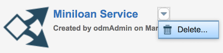

# Task 5: Cleaning out databases

In this task, you learn how to delete projects from Decision Center and the Rule Execution Server console.

**About this task**

When you no longer need a project, you can delete it from its database. You can leave this task to your administrator. However, if the instance of the project is yours and you want to do this tutorial again, you can do the cleanup yourself. If you want to keep your changes, you can export a compressed file of the project from Decision Center before deleting the project.

## Step 1: Deleting the decision service from Decision Center 

You remove the Miniloan Service decision service from the Decision Center database.

**Procedure**

1.   Open the Decision Center Business console.
2.  Log in as an administrator by entering `odmAdmin` as the user name and password. You must be an administrator to remove the decision service. The rtsUser1 login cannot remove the decision service.
3.  Open the **Library** tab.
4.  Hover over the Miniloan Service box, open the drop-down menu, and click **Delete**:

A warning message opens. Make sure that the message shows the decision service that you want to delete.

5.  Click **Delete**.

## Step 2: Removing the RuleApp from the Rule Execution Server console

You remove the decision artifacts from the Rule Execution Server console.

**Procedure**

1.  Open the Rule Execution Server console. 
2.  Log in as an administrator by entering `odmAdmin` as the user name and password.
3.   Open the **Explorer** tab, and click **RuleApps** under **Navigator**. 
4.   Select the mydeployment RuleApp, and click **Remove** to delete it. A warning message opens. Make sure that the message shows the RuleApp that you want to delete.
5.   Click **Confirm** in the warning message. The console deletes your RuleApp. The RuleApp view opens, and it no longer shows your RuleApp.
6.  In the **Explorer** tab, click **Resources** under **Navigator**.
7.  Select miniloan-xom.zip, and click **Remove all references**. A warning message opens. It shows the execution object model that you selected.
8.  Click **Confirm** in the warning message. Now the execution object model is not referenced from any ruleset or library.
9.  Select miniloan-xom.zip, and click **Remove** to remove the execution object model cleanly.
10. In the **Explorer** tab, click **Libraries** under **Navigator**.
11. Select mydeployment\_1.0, and click **Remove** to remove the library. 

    **Note:** You can also remove the Miniloan\_Service\_brm.Branch\_xx\_xx library. This library was created when you ran the test suite.

You have completed the tutorial and removed the decision service files from Decision Center and the Rule Execution Server console. You now know some of the key features in Operational Decision Manager for Developers.

[ **Back to table of contents**](../README.md)

