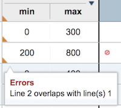

# Task 2: Creating and editing rules

In this task, you learn how to search for rules, modify a decision table, and create an action rule in the Business console..

Business experts develop and deploy decision services in Decision Center. Distributed business teams can collaborate through the web-based environment to create and maintain decision logic. They can modify rules to meet changes in policies without changing the applications that call the rules. They can apply business decisions immediately without developers having to recode production applications. 

Typically, developers working in Rule Designer can develop a new version of a decision service in response to changing application infrastructure and core business requirements, and business experts can work in Decision Center on new decisions that are delivered in response to an evolving market or a changing regulatory environment. With this separation, decisions and application architecture can be managed asynchronously. 

In this task, you make the following changes for the loan company in the Miniloan project:

-   The length of a loan cannot be shorter than 6 months. You apply this policy to all incoming requests.
-   The company wants to increase the minimum credit score from 200 to 300 for all new loan requests.

## Step 1: Searching for rules

You do a search to find the rules in the decision service that handle the credit score.

**Procedure**

1.  Log in to the Business console by using `rtsUser1` as the user name and password.
2.  Open the **Library** tab.
3.  Hover over the Miniloan Service box, and click anywhere except the name to expand it. Then click **main** under **Recently updated branches** to open the **main** branch. 
4.   In the **Search for rules** field, type score and press Enter. The results show all the action rules and decision tables in which the word score occurs. You look at all the rules, and conclude that you must edit the **repayment and score** decision table.

## Step 2: Modifying a decision table

You start by checking the history of changes to the decision table, and then you edit the rule. You make a mistake and correct it.

**Procedure**

1.   Click **repayment and score** to display the decision table. 
2.   Click **Timeline**. The history of changes for the decision table shows no recent changes.
3.   Click **Exit Timeline**. 
4.   Click **Edit**. 
5.   Double-click the number `200` in row 1 of the **credit score** column and enter the value 300. Do not change this value in row 2 yet.
6.   Click **Details** and change the status to **Defined**. You can use the rule properties for different purposes in Decision Center, such as the organization and workflow, permissions, testing, and deployment.
7.   Close the property window. 
8.   Click **Save**. 
9.   Type the comment "Changed credit score to 300" and click **Create New Version**. The decision table now displays v1.1. Decision Center creates a new version with the changes. The major version number 1 is assigned to the main branch. Any new branch, including the branches of the governance framework, take the next available number. The minor version number corresponds to the number of changes made in the branch.

## Step 3: Correcting an error

You check the decision table and find an error. You correct the error, save your work, and leave a comment about the error correction.

**Procedure**

1.   Hover over one of the fields with a gold triangle in the decision table. It shows an overlap error:

 

2.   Click **Edit** to reopen the table. 
3.   Double-click the credit score condition for row 2, change the value 200 to 300, and press Enter. This change eliminates the overlap in rows 1 and 2. 
4.   Click **Save**. 
5.   In the Create New Version window, type the comment "Fix for gap error" and click **Create New Version**. 

## Step 4: Creating a new action rule

You implement the policy that shortens the minimum length of a loan to 6 months.

**Procedure**

1.   Click **main** in the breadcrumbs below the top banner to return to the contents of the branch. 
2.   Open the validation folder, which contains the rules for validating loan data. 
3.   Click the **Add** button  button, and then click **New Rule**. 
4.   Type the name **check duration**, and click **Create**. 
5.   Copy and paste the following rule into the rule editor, or build the rule with the completion menu. 
    
    if
          the duration of 'the loan' is less than 6
    then
          add "The duration of the loan is too short" to the messages of 'the loan';
          reject 'the loan';
    

6.   Click **Save**. 
7.   Type "Added for Summer policy" and click **Create New Version**. 
9.  Log out of the Business console. You've finished the updates.

In the next task, you test and deploy the decision service. 

[**Next**](../topics/tut_icp_gs_test_deploy_lsn.md)

[ **Back to table of contents**](../../README.md)

