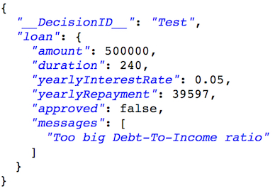

# Task 4: Exploring and testing the ruleset

In this task, you learn how to open and explore a RuleApp in the Decision Server console, and test a ruleset with a REST request.

The Decision Server console is used to manage and execute rulesets, trace executions, and display the rules in RuleApps.

In this task, you explore your deployed artifacts in the Decision Server console. You make sure the status of the ruleset is enabled for execution, and send a JSON-formatted REST request to the ruleset.

## Step 1: Viewing the deployed RuleApp

You view the RuleApp in the Decision Server console and check the status of the ruleset.

**Procedure**

1.   Sign in to your instance of the Decision Server console as **admin user**.
2.  Click the **Explorer** tab.
3.   In the Navigator, expand **RuleApps**, and then /mydeployment/1.0. You see that the Decision Server console contains version 1.0 of mydeployment, which contains version 1.0 of Miniloan\_ServiceRuleset:

 

4.   Click /Miniloan\_ServiceRuleset/1.0 to view the details of the ruleset in the Ruleset View. The status of the ruleset is enabled, which indicates that the ruleset can be run:

 


## Step 2: Testing the ruleset with a REST request

You test the ruleset with a REST request in the Decision Server console.

**Procedure**

1.   In the Decision Server console, on the Miniloan\_ServiceRuleset page, click **Retrieve HTDS Description File**.
2.   Select the **REST** option, and then choose **OpenAPI-JSON** for the format.
3.  Click **View** and copy the URL. The decision service URL uses the following format:

  ```
  http(s)://<DSC_ENDPOINT>/DecisionService/rest/v1/mydeployment/1.0/Miniloan_ServiceRuleset/1.0/
  ```

  > **Note**
  > You can export this URL as `DSC_URL` environment variable to execute the request in [Step 3 \(optional\): Testing the execution of the ruleset using curl](../topics/tut_icp_gs_test_ruleset_lsn.md#step-3-optional-testing-the-execution-of-the-ruleset-using-curl).

4.  Close the web page.
5.  Back on the Miniloan\_ServiceRuleset page, click **Retrieve HTDS Description File**.
6.   Make sure **REST** and **OpenAPI-JSON** are still selected, and click **Test**.
7.   On the REST Service page, replace the entire request description with the following text:

    ```json
    {
       "loan": {
           "amount":500000,
           "duration":240,
           "yearlyInterestRate": 0.05
       },
       "__DecisionID__": "Test",
       "borrower": {
          "name":"Joe",
          "creditScore":600,
          "yearlyIncome":80000
       }
    }
    ```


8.  Click **Execute request**. The Server Response returns the following data:

 

 It shows that the loan is rejected because the debt-to-income ratio is too high.

9.  Log out of the Decision Server console.

## Step 3 \(Optional\): Testing the execution of the ruleset by using cURL

You test the execution of the Miniloan\_ServiceRuleset ruleset in a command terminal by using cURL, a command-line tool for getting or sending files by using the URL syntax. This step is optional. If you do not wish to install cURL, you cannot perform this step. It is recommended to go through this step even if you choose not to perform it, as it shows an example of how to execute a ruleset by using an external client.

**Procedure**

1.  Open a command terminal.
2.  Go to the location where you previously downloaded ([execution-payload.json](../../execution-payload.json?raw=1)).
3.  Type the following command:

    ```
    curl -k -X POST -H "Content-Type: application/json" \
         -u <admin_user>:<admin_password> -d "@execution-payload.json" \
         ${DSC_URL}
    ```

    Where `DSC_URL` is the URL from [Step 2: Testing the ruleset for REST execution](../topics/tut_icp_gs_test_ruleset_lsn.md#step-2-testing-the-ruleset-for-rest-execution).

 The command issues a POST request for the URL of your decision service. The execution parameters are stored in the execution-payload.json file.

4.  Press Enter. The command returns the following output:

 

 It shows that the loan is rejected because the debt-to-income ratio is too high.

You have finished the tutorial, and no longer need the decision service in Decision Center and the Decision Server console. In the next task, you remove the Miniloan decision service from Decision Center and the Decision Server console.

[**Next** ](../topics/tut_icp_gs_clean_db_lsn.md)

[ **Back to table of contents**](../../README.md)
