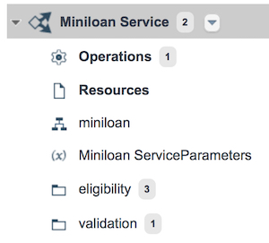
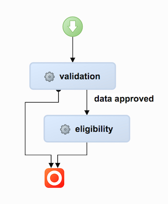
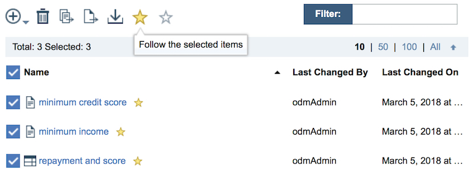
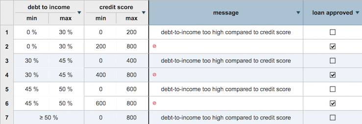
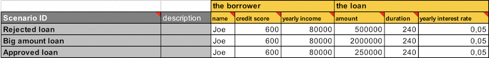
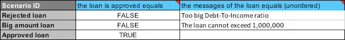
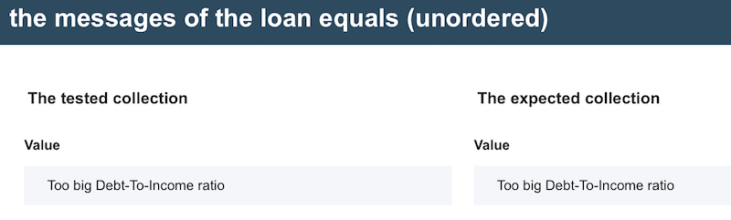
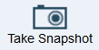

# Task 1: Evaluating the decisions

In this task, you look at the rules that a loan company uses to determine whether borrowers are eligible for a loan. You also explore the ruleflow that orchestrates the application of the rules, and test the rules.

When a company implements a decision, it becomes a business policy. Policies can cover all aspects of a company's operations, for example, determining prices, recommending products, and evaluating eligibility. With ODM, you convert these policies into business rules that production applications use to automatically apply decisions. When decision making is separate from application code, business experts can more easily define and manage the business logic.

The process of capturing a business policies in rules happens in two steps: 

1.   Create a vocabulary to express the policies.  
2.   Transform the logic of the business policy into if-then statements, or rules. 

This tutorial demonstrates how ODM increases a company's ability to respond to changes in business, and how much time and effort the product can save business experts in updating business logic.

You start by importing a decision service and displaying its artifacts.

## Step 1: Importing the decision service

You import the Miniloan Service decision service into Decision Center, and then display its rule artifacts.

**Procedure**

1.   Open the Decision Center Business console. 
2.   Log in by entering `odmAdmin` as the user name and password. 

 **Note:** If you see that Miniloan Service is already available in the **Library** tab, you must remove it before you can import it again. Ask your administrator if you can remove the existing Miniloan Service decision service, and refer to the following page to learn how to remove a decision service from Decision Center: [Step 1: Deleting the decision service from Decision Center](../gs_topics/tut_icp_gs_clean_db_lsn.md#step-1-deleting-the-decision-service-from-decision-center).

3.  Click the **Import Decision Service** button .
4.  Click **Choose** and browse to the .zip file you downloaded from GitHub.
5.  Make sure **Use Decision Governance Framework** is not selected. To simplify the tutorial, you work in an ungoverned branch of the decision service.
6.  Click **Import**. The Miniloan Service decision service automatically opens. You see the **Releases** and **Branches** tabs. Because you chose not to use the decision governance framework, you can see that the **Releases** tab is empty.
7.   Open the **Branches** tab, and then click the **main** branch. A decision service can contain many projects. For simplicity, all the rules of Miniloan Service are contained in its top-level project, which has the same name as the decision service.
8.  Click **All types** in the **Types** window to display all the artifacts. In the **Decision Artifacts** tab, you can see a folder for the decision operations, the miniloan ruleflow, and folders that contain the rules:

 

## Step 2: Exploring the ruleflow

You open and explore the miniloan ruleflow.

**Procedure**

1.   In the **Decision Artifacts** tab, click the miniloan ruleflow:

 

The ruleflow states the sequence for applying the rules:

 

 The ruleflow first applies the validation rules. If the data from a loan request passes the validation conditions, the ruleflow directs the request to the eligibility rules. However, if the validation decision point does not approve the data, the ruleflow skips the eligibility decision point, and the decision service stops processing the loan request. If you click the end node, you can see that the final execution is to print the status of the loan.

## Step 3: Following changes to rules

You want to review the business rules and track the changes that are made to them.

**Procedure**

1.   Under **Miniloan Service**, click the eligibility folder to view its contents. 
2.   Click the check box beside **Name** to select all the rules in the folder, and then click the gold star in the toolbar to follow all the rules in the folder. A gold star is displayed next to each rule. Changes to these rules are now displayed on your home tab.

 

## Step 4: Viewing the business rules

You explore the business rules in the decision service to understand the policies that they implement.

Business rules come in two formats:

-   Action rules: An action rule states the conditions and actions of a policy in a natural language. When the conditions of an action rule are met, the actions of the rule are applied. Otherwise, no action is taken.
-   Decision tables: A decision table provides a way to view and manage sets of similar rules together. A decision table contains condition and action columns. Each row in a decision table forms a complete action rule. 

**Procedure**

1.   In the eligibility folder, click **minimum credit score** to display the action rule. It rejects a loan application if the credit score is below 200.
2.   Click the **Back** button just above the displayed rule to see all the rules. 
3.   Click **repayment and score** to display the decision table. 

 The first two columns in the table define the conditions, and the other columns define the actions.

 

## Step 5: Creating and running a test suite

You explore and run the miniloan-test test suite. It is in the Getting Started for ODM for Developers sample project that you downloaded and extracted.

**Procedure**

1.   Open the miniloan-test Excel file in GettingStartedDirectory/odm-for-dev-gettingstarted-master/Miniloan Service. 

 The Excel scenario file contains worksheets. The **Scenarios** sheet contains data to execute the rules.

 The file has three scenarios:

 -   **Rejected loan**: Contains data for loans that are rejected.
 -   **Big amount loan**: Contains data for loans that are rejected.
 -   **Approved loan**: Contains data corresponding to a loan that is accepted with the current state of the rules.
 
 The following figure shows the three scenarios in the **Scenarios** sheet:

 

 The following figure shows the expected values in the **Expected Results** sheet:

 

 The **Expected Results** sheet contains the expected values for the following tests:

 -   **Whether the loan request is approved.**

     You expect the first two loans to be rejected and the last loan to be approved.

 -   **The report contains the appropriate message.**

     You expect the report to state that the debt-to-income ratio is too big for the first scenario, and to state that the loan cannot exceed the maximum amount for the second scenario. You do not expect any message to be returned for the last scenario.

 When you run the test suite, it compares the expected results with the actual results and generates a report.

2.  Close the Excel file.
3.  Back in the Business console, open the **Tests** tab. 
4.  Click the **New Test Suite** button .
5.  In **File to use**, browse to miniloan-test.xlsx on your computer.
6.  Click **Save and run**.
7.  Type the comment Running test suite and click **Create new version**.
8.  Click **OK** to run the test suite.
9.  On the **Reports** subtab, open the report when its status shows a check mark. It shows that the three tests ran successfully. In the **Results** section, you can see the status of the testing for each scenario. The results of the three tests shown in the report match the expected results, that is:

 -   Loan requests are rejected for **Rejected loan** and **Big amount loan** and approved for **Approved loan**.
 -   The messages match the expected results.
 **Details...** dialogs can be opened for collection values. For example, expand **Rejected loan** and open the **Details...** dialog for **the messages of the loan equals** to see the actual and expected values of the tested scenario:

 

10. Close the report.

## Step 6: Taking a snapshot

You take a snapshot of the rules before they are changed.

**Procedure**

1.   Click **Take Snapshot**:

.

2.   In the **Take a Snapshot** window, enter "Initial State" as the name, and "Snapshot of the initial state of the branch" as the description, and then click **Create**. You can now find the snapshot in the **Snapshots** tab. A snapshot captures the state of a branch at a specific moment in time. You cannot edit the contents of a snapshot, but you can use a snapshot to restore a branch to a previous state.

3.   Click **Log out** in the drop-down menu next to the user name odmAdmin.

In the next task, you search for rules, modify a decision table, and create an action rule in the Business console. 

[**Next** ](../gs_topics/tut_icp_gs_create_rules_lsn.md)

[ **Back to table of contents**](../README.md)

