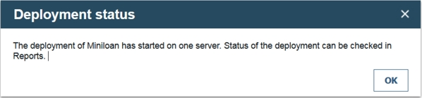

# Task 3: Verifying updates and deploying

In this task, you learn how to compare the current state of a branch with a snapshot, and deploy a decision service.

Business experts want to manage the business policies, and test them to make sure they work as expected. Decision Center enables users to work on separate copies of a project without interfering with one another, and update and test rules before they are used by an application. The Business console helps users to author new rules, organize their projects, and search for rules.

In this task, you compare the results of the changes made in task 2 with the previous \(initial\) version. Then, you validate the behavior of the changes against the usage scenarios from task 1, and deploy a RuleApp to a rule execution environment.

## Step 1: Comparing the results with the initial state

You review the changes to Miniloan Service.

**Procedure**

1.   Log in to the Business console as odmAdmin. In the **HOME** tab, in **Recent Activities**, you see the action rule and decision table that rtsUser1 modified.
2.   Hover over **repayment and score**, and click **main** in the rule description to go directly to the main branch of **Miniloan Service**. 
3.   Click the **Snapshots** tab. 
4.   Click **Initial State**. You see the state of the branch when you made the snapshot.
5.   Click **Compare**. The Business console proposes to compare the Initial State snapshot with the current state of the project.
6.   Click **Compare**. By default, the console shows the updated table.
7.   Click **Added** to see the new rule. 
8.   Click **Updated** to see the updated rule.
9.   Hover over the row for **repayment and score**, and click the **Compare** button in the row to see the differences between the two versions of the decision table. 
10.  Close the version comparison. 
11.  Click **main** in the breadcrumbs to leave the snapshot. 

## Step 2: Rerunning the test suite

You check that the changes to the loan approval policies produce the expected behavior.

**Procedure**

1.  Click the **Tests** tab. This tab contains the existing test suites, and the reports created by the test suites.
2.   Hover over the existing test suite row, and click the **Run** button . 
3.   Click **OK**, wait until the status shows a check mark, and click the name of the report. The report shows that 100% of the scenarios are successful because they generate the expected results.
4.  Close the report.

## Step 3: Deploying a RuleApp from the decision service

Now that you are satisfied with the results, you deploy a RuleApp from the decision service.

**Procedure**

1.   Click the **Deployments** tab to see its contents. This tab contains the existing deployment configurations, and the reports created during previous deployments.
2.  Click the **Miniloan** deployment configuration. Go through the tabs in the deployment configuration:
    -   **General**: Provides an overview of the deployment configuration, including the name, type, and RuleApp name and base version number.
    -   **Operations**: Lists the decision operations to deploy. Here, **Miniloan ServiceOperation** is selected for deployment. Decision operations define how the rules you are changing are used in specific rulesets for deployment. Hover over the decision operation name to see its content.
    -   **Targets**: Lists where the rules can be deployed.
    -   **Ruleset Properties**: Defines the versioning policy for each deployment.
    -   **Groups**: Lets the administrator choose the groups that are able to use the deployment configuration.
    -   **Deployment Snapshot**: Defines whether a snapshot is taken at the moment of deployment.
3.  Click the **Edit** button in the upper right corner of the window.
4.  Click the **Targets** tab.
5.  Select **Decision Service Execution** and click the **Save** button.
6.  Type Miniloan with Summer policy, and click **Create new version**.
7.   Click the **Deploy** button  in the upper right corner of the window. A dialog box opens with a summary of the deployment configuration. It gives you the option of deploying to a server or creating a RuleApp archive. 
8.   Leave **Server** selected in the dialog, and click **Deploy**. A message opens with the status of the deployment:

 

9.   Click **OK** in the deployment status message. The **Reports** subtab opens in the **Deployments** tab.
10.  Click the name of the report when its status shows a check mark. The report opens and shows a summary of the deployment. It includes the target server, the configuration name, the ruleset, the deployment time, the version of the ruleset, and the deployment snapshot.
11.  Click the **Close** button  in the upper right corner of the window to close the report, and log out of the Business console. 

In the next task, you explore your ruleset in the Decision Server console and test it. 

[**Next** ](../gs_topics/tut_icp_gs_test_ruleset_lsn.md)

[ **Back to table of contents**](../README.md)

